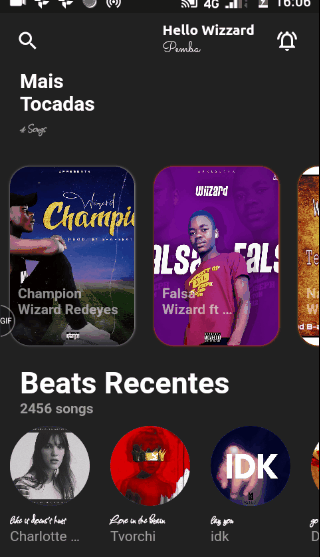
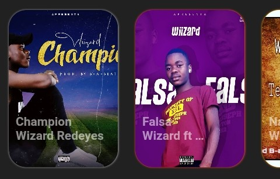
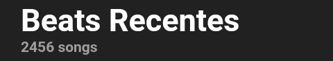
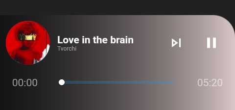
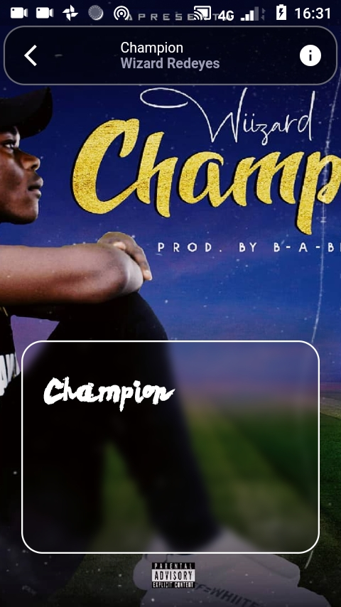
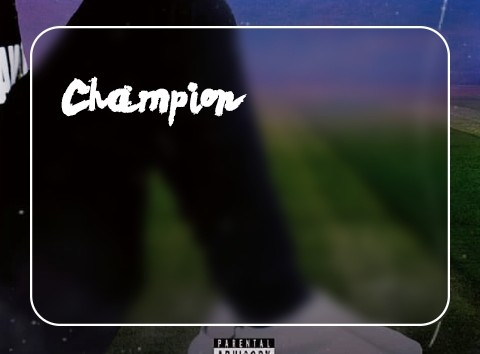

# wizard
Aplicativo para meu nigga rapper Benildo aka Wizard

```dart
GetX controller
class Controller extends GetxController {
	
  @override
  void onInit() { // called immediately after the widget is allocated memory
    fetchApi();
    super.onInit();
  }

  @override
  void onReady() { // called after the widget is rendered on screen
    showIntroDialog();
    super.onReady();
  }

  @override
  void onClose() { // called just before the Controller is deleted from memory
    closeStream();
    super.onClose();
  }

}


```

<!-- 


-->

#modelo Fake

```dart
import 'package:flutter/material.dart';

class AssetSong {
  final String name;
  final String singer;
  final String image;
  final int duration;
  MaterialColor color;

  AssetSong(
      {required this.name,
      required this.singer,
      required this.image,
      required this.duration,
      required this.color});
}

List<AssetSong> fake_mostPopular = [
  AssetSong(
    name: 'Champion',
    image: 'assets/musics/wiizard_redeyes_champion.jpg',
    singer: 'Wizard Redeyes',
    duration: 241,
    color: Colors.grey,
  ),
  AssetSong(
    name: 'Falsa',
    image: 'assets/musics/wiizard_redeyes_falsa.jpeg',
    singer: 'Wizard ft BiBowling',
    duration: 320,
    color: Colors.red,
  ),
  AssetSong(
    name: 'Nao Sabes',
    image: 'assets/musics/wiizard_redeyes_oque_faco.jpg',
    singer: 'Wizard Redeyes ft Tenebrose Derko',
    duration: 300,
    color: Colors.orange,
  ),
  AssetSong(
    name: 'XINGONDO',
    image: 'assets/musics/wiizard_redeyes_xigondo.jpg',
    singer: 'Wizard Redeyes',
    duration: 300,
    color: Colors.blue,
  ),
];

List<AssetSong> fake_new_release = [
  AssetSong(
    name: "like it doens't hurt",
    image: 'assets/images/other/song1.jpg',
    singer: 'Charlotte Cardin',
    duration: 241,
    color: Colors.blue,
  ),
  AssetSong(
    name: 'Love in the brain',
    image: 'assets/images/other/song2.jpg',
    singer: 'Tvorchi',
    duration: 320,
    color: Colors.orange,
  ),
  AssetSong(
    name: 'lay you',
    image: 'assets/images/other/song4.jpg',
    singer: 'idk',
    duration: 300,
    color: Colors.red,
  ),
  AssetSong(
    name: 'go to the hello',
    image: 'assets/images/other/song3.jpg',
    singer: 'Danito',
    duration: 300,
    color: Colors.grey,
  ),
];


```
# Demo 1:



#codogo correspondente ao HomePage
```dart
import 'dart:math';
import 'package:wizard/app/ui/utils/helpers.dart';
import 'components/body.dart';

class HomePage extends GetView<HomeController> {
  final String? user_name;

  HomePage({this.user_name});
  @override
  Widget build(BuildContext context) {
    print('HOME PAGE');
    Size size = MediaQuery.of(context).size;
    return Scaffold(
      backgroundColor: Colors.grey[900],
      appBar: AppBar(
        brightness: Brightness.dark,
        backgroundColor: Colors.grey[900],
        elevation: 0,
        leading: Icon(
          Icons.search,
        ),
        actions: [
          Column(
            mainAxisAlignment: MainAxisAlignment.center,
            crossAxisAlignment: CrossAxisAlignment.start,
            children: [
              Text(
                'Hello Wizzard',
                style: TextStyle(
                    fontWeight: FontWeight.bold, fontFamily: 'Ubuntu'),
              ),
              Text(
                'Pemba',
                style: TextStyle(fontSize: 15, fontFamily: 'Sacramento'),
              ),
            ],
          ),
          Padding(
            padding: EdgeInsets.all(8.0),
            child: IconButton(
                icon: Icon(
                  Icons.notifications_active_outlined,
                ),
                onPressed: () => Get.snackbar(
                    'Notificacoes',
                    Strings.on_tab_notiy_test[
                        Random().nextInt(Strings.on_tab_notiy_test.length)])),
          ),
        ],
      ),
      body: SafeArea(child: Body(size)),
    );
  }
}

```
#Widget do body()

``` dart
import 'dart:math';

import 'package:wizard/app/ui/utils/helpers.dart';

import 'circle_track_widget.dart';
import 'player_widget.dart';
import 'track_widget.dart';

class Body extends GetView<AppController> {
  final Size size;

  Body(this.size);

  @override
  Widget build(BuildContext context) {
    return Stack(
      children: [
        SingleChildScrollView(
          child: Column(
            crossAxisAlignment: CrossAxisAlignment.start,
            mainAxisAlignment: MainAxisAlignment.center,
            children: [
              Padding(
                padding: EdgeInsets.only(left: 20.0),
                child: Text(
                  'Mais',
                  style: TextStyle(
                    color: AppColors.secondaryTextColor,
                    fontSize: 20,
                    fontWeight: FontWeight.bold,
                  ),
                ),
              ),
              Padding(
                padding: EdgeInsets.only(
                  left: 20.0,
                ),
                child: Text(
                  'Tocadas',
                  style: TextStyle(
                    color: AppColors.secondaryTextColor,
                    fontSize: 20,
                    fontWeight: FontWeight.bold,
                  ),
                ),
              ),
              Padding(
                padding: EdgeInsets.only(
                  left: 20.0,
                  top: 5,
                  bottom: 20,
                ),
                child: Text(
                  '${fake_new_release.length} Songs',
                  style: TextStyle(
                    color: Colors.grey,
                    fontFamily: 'Fuggles',
                    fontWeight: FontWeight.bold,
                  ),
                ),
              ),
              Container(
                height: size.height * 0.350,
                child: TrackWidget(
                  size: size,
                  notifyParent: refresh,
                ),
              ),
              CircleTrackWidget(
                songs: fake_new_release,
                title: 'Beats Recentes',
                subtitle: '2456 songs',
                notifyParent: refresh,
              ),
              SizedBox(height: 34),
              Obx(() => Container(
                    margin: EdgeInsets.symmetric(
                      horizontal: 10,
                    ),
                    height: 200,
                    width: 300,
                    decoration: BoxDecoration(
                      color: controller.current_song.value.color,
                      gradient: LinearGradient(
                        colors: [
                          Colors.white,
                          controller.current_song.value.color,
                        ],
                      ),
                    ),
                    child: Container(
                      height: 40,
                      width: 50,
                      child: ClipRRect(
                        child: Image.asset(
                          controller.current_song.value.image,
                          fit: BoxFit.cover,
                        ),
                      ),
                    ),
                  )),
              CircleTrackWidget(
                songs: [...fake_mostPopular, ...fake_new_release],
                title: 'Beats Favoritas',
                subtitle: '${[
                  ...fake_mostPopular,
                  ...fake_new_release
                ].length} songs',
                notifyParent: refresh,
              ),
              SizedBox(
                height: 130,
              ),
              Obx(
                () => Align(
                  alignment: Alignment.bottomLeft,
                  child:
                      PlayerHome(current_song: controller.current_song.value),
                ),
              ),
            ],
          ),
        )
      ],
    );
  }

  refresh() {
    print('hi');
  }
}

```

# WIDGET COM PLAYLIST DE MAIS TOCADAS que e TrackWidget
```dart
// Dentro do Body Esta assim :
Container(
    height: size.height * 0.350,
    child: TrackWidget(
      size: size,
      notifyParent: refresh,
    ),
  ),

//TrackWidget(size,VoidCallback)
```


#os Widgets Mais Tocadas 

```dart
import 'package:wizard/app/ui/utils/helpers.dart';

class TrackWidget extends GetView<AppController> {
  final VoidCallback notifyParent;
  Size size;

  TrackWidget({required this.notifyParent, required this.size});
  @override
  Widget build(BuildContext context) {
    return ListView.builder(
        shrinkWrap: true,
        scrollDirection: Axis.horizontal,
        itemCount: fake_mostPopular.length,
        itemBuilder: (context, index) {
          return GestureDetector(
            onTap: () {
              print('Tracando o song');
              controller.chnage_song_by_index(index);
            },
            child: Container(
              margin: EdgeInsets.all(10),
              width: size.width * 0.390,
              // height: 150,
              decoration: BoxDecoration(
                  borderRadius: BorderRadius.circular(20),
                  boxShadow: [
                    BoxShadow(
                      color: fake_mostPopular[index].color,
                      blurRadius: 1,
                      spreadRadius: 0.3,
                    ),
                  ],
                  image: DecorationImage(
                    image: AssetImage(
                      fake_mostPopular[index].image,
                    ),
                    fit: BoxFit.cover,
                  ),
                  color: fake_mostPopular[index].color),
              child: Padding(
                padding: EdgeInsets.all(8.0),
                child: Column(
                  mainAxisAlignment: MainAxisAlignment.end,
                  crossAxisAlignment: CrossAxisAlignment.start,
                  children: [
                    Text(
                      fake_mostPopular[index].name,
                      softWrap: true,
                      overflow: TextOverflow.ellipsis,
                      style: TextStyle(
                        color: Colors.white54,
                        fontWeight: FontWeight.bold,
                        // fontSize: 42,
                      ),
                    ),
                    Text(
                      fake_mostPopular[index].singer,
                      softWrap: true,
                      overflow: TextOverflow.ellipsis,
                      style: TextStyle(
                        color: Colors.white54,
                        fontWeight: FontWeight.bold,
                        // fontSize: 42,
                      ),
                    ),
                    SizedBox(
                      height: 20,
                    ),
                  ],
                ),
              ),
            ),
          );
        });
  }
}


```


#Recentes

# Circle Widget


```dart
import 'package:wizard/app/ui/utils/helpers.dart';

class CircleTrackWidget extends GetView<AppController> {
  final String title;
  final List<AssetSong> songs;
  final String subtitle;
  final VoidCallback notifyParent;

  CircleTrackWidget(
      {required this.notifyParent,
      required this.title,
      required this.songs,
      required this.subtitle});

  @override
  Widget build(BuildContext context) {
    Size size = MediaQuery.of(context).size;
    return Container(
      height: size.height * 0.4,
      child: Column(
        crossAxisAlignment: CrossAxisAlignment.start,
        children: [
          Padding(
            padding: EdgeInsets.only(
              left: 20,
              top: 10,
            ),
            child: Text(
              title,
              style: TextStyle(
                fontSize: 30,
                fontWeight: FontWeight.bold,
                color: Colors.white,
              ),
            ),
          ),
          Padding(
            padding: EdgeInsets.only(
              left: 20,
              bottom: 10,
            ),
            child: Text(
              subtitle,
              style: TextStyle(
                fontWeight: FontWeight.bold,
                color: Colors.grey,
              ),
            ),
          ),
          Container(
            height: 120,
            child: ListView.builder(
              itemCount: songs.length,
              scrollDirection: Axis.horizontal,
              shrinkWrap: true,
              itemBuilder: (ctx, index) {
                var song = songs[index];
                return GestureDetector(
                  onTap: () {
                    //Todo: ainda nao funciona
                    controller.current_song_list.value = songs;
                    controller.chnage_song_by_index(index);
                  },
                  child: Container(
                    margin: EdgeInsets.symmetric(horizontal: 10),
                    width: size.width * 0.252,
                    child: Column(
                      crossAxisAlignment: CrossAxisAlignment.start,
                      children: [
                        CircleAvatar(
                          radius: 40,
                          backgroundImage: AssetImage(
                            song.image,
                          ),
                        ),
                        SizedBox(
                          height: 5,
                        ),
                        Text(
                          song.name,
                          style: TextStyle(
                            color: Colors.white,
                            fontWeight: FontWeight.bold,
                            fontFamily: 'Fuggles',
                          ),
                        ),
                        Text(
                          song.singer,
                          softWrap: true,
                          overflow: TextOverflow.ellipsis,
                          style: TextStyle(
                            color: Colors.white54,
                          ),
                        ),
                      ],
                    ),
                  ),
                );
              },
            ),
          ),
        ],
      ),
    );
  }
}


```


#Bottom Player



```dart
import 'package:wizard/app/ui/utils/helpers.dart';

class PlayerHome extends GetView<AppController> {
  final AssetSong current_song;

  PlayerHome({required this.current_song});

  @override
  Widget build(BuildContext context) {
    Size size = MediaQuery.of(context).size;
    return Obx(
      () => GestureDetector(
        onTap: () {
          Get.to(() => MusicplayerPage(song_playing: current_song));
        },
        child: Container(
          height: 130,
          padding: EdgeInsets.all(8.0),
          decoration: BoxDecoration(
            // color: Colors.black.withOpacity(0.3),
            color: controller.current_song_color.value,
            borderRadius: BorderRadius.only(
              topRight: Radius.circular(30),
            ),
            gradient: LinearGradient(
              colors: [Colors.black38, controller.current_song_color.value],
            ),
          ),
          child: Column(
            children: [
              Row(
                mainAxisAlignment: MainAxisAlignment.spaceBetween,
                children: [
                  Row(
                    children: [
                      Hero(
                        tag: 'image',
                        child: CircleAvatar(
                          backgroundImage: AssetImage(
                            current_song.image,
                          ),
                          radius: 30,
                        ),
                      ),
                      SizedBox(
                        width: 10,
                      ),
                      Column(
                        crossAxisAlignment: CrossAxisAlignment.start,
                        children: [
                          Text(
                            current_song.name,
                            softWrap: true,
                            overflow: TextOverflow.ellipsis,
                            style: TextStyle(
                              color: AppColors.secondaryTextColor,
                              fontSize: 14,
                              fontWeight: FontWeight.bold,
                            ),
                          ),
                          Text(
                            current_song.singer,
                            softWrap: true,
                            overflow: TextOverflow.ellipsis,
                            style: TextStyle(
                              color: Colors.white54,
                              fontSize: 8,
                            ),
                          ),
                        ],
                      ),
                    ],
                  ),
                  Row(
                    children: [
                      IconButton(
                        onPressed: () {
                          controller.next_song();
                        },
                        icon: Icon(
                          Icons.skip_next_outlined,
                          color: Colors.white,
                          // size: 30,
                        ),
                      ),
                      IconButton(
                        onPressed: () {},
                        icon: Icon(
                          Icons.pause,
                          color: Colors.white,
                          // size: 0,
                        ),
                      ),
                    ],
                  ),
                ],
              ),
              Row(
                mainAxisAlignment: MainAxisAlignment.spaceEvenly,
                children: [
                  Text(
                    Duration(seconds: controller.current_slider.value.toInt())
                        .toString()
                        .split('.')[0]
                        .substring(2),
                    style: TextStyle(color: Colors.white54),
                  ),
                  Container(
                    width: size.width - 120,
                    child: SliderTheme(
                      data: SliderTheme.of(context).copyWith(
                          thumbShape:
                              RoundSliderThumbShape(enabledThumbRadius: 4),
                          trackShape: RectangularSliderTrackShape(),
                          trackHeight: 4),
                      child: Slider(
                        activeColor: Colors.white,
                        max: controller.current_song.value.duration.toDouble(),
                        value: controller.current_slider.value,
                        min: 0,
                        onChanged: (d) {
                          controller.change_song_duration(d);
                        },
                      ),
                    ),
                  ),
                  Text(
                    Duration(seconds: controller.current_song.value.duration)
                        .toString()
                        .split('.')[0]
                        .substring(2),
                    style: TextStyle(color: Colors.white54),
                  ),
                ],
              ),
            ],
          ),
        ),
      ),
    );
  }
}


```

#MUSIC PLAYER HOME


```dart
import 'dart:ui';

import 'package:wizard/app/ui/utils/fonts.dart';
import 'package:wizard/app/ui/utils/helpers.dart';
import 'package:wizard/app/ui/utils/helpers.dart';

class MusicplayerPage extends GetView<MusicplayerController> {
  final AssetSong song_playing;
  final AppController app_controller = Get.find<AppController>();
  MusicplayerPage({
    required this.song_playing,
  });
  // MusicplayerPage create() => MusicplayerPage();
  @override
  Widget build(BuildContext context) {
    Size size = MediaQuery.of(context).size;
    return Scaffold(
      body: Scaffold(
        body: Stack(
          children: [
            Align(
              alignment: Alignment.topCenter,
              child: Container(
                height: kToolbarHeight,
                width: size.width * 0.8,
                color: Colors.white24,
              ),
            ),
            Hero(
              tag: 'image',
              child: Container(
                // child: Text('MusicplayerController'),
                height: size.height,
                width: size.width,
                decoration: BoxDecoration(
                  image: DecorationImage(
                    image: AssetImage(song_playing.image),
                    fit: BoxFit.cover,
                  ),
                ),
              ),
            ),
            SafeArea(
              child: Align(
                alignment: Alignment.topCenter,
                child: Container(
                  height: kToolbarHeight,
                  width: size.width * 0.98,
                  decoration: BoxDecoration(
                    color: Colors.black54,
                    border: Border.all(
                      width: 1.5,
                      color: Colors.white38,
                    ),
                    boxShadow: [
                      BoxShadow(
                        blurRadius: 33,
                        spreadRadius: 6,
                        color: Colors.black.withOpacity(0.2),
                      ),
                    ],
                    borderRadius: BorderRadius.circular(20),
                  ),
                  child: Row(
                    mainAxisAlignment: MainAxisAlignment.spaceBetween,
                    children: [
                      IconButton(
                        icon: Icon(
                          Icons.arrow_back_ios_new_outlined,
                          color: Colors.white,
                        ),
                        onPressed: () => Get.back(),
                      ),
                      Wrap(
                        direction: Axis.vertical,
                        children: [
                          Text(
                            '${song_playing.name}',
                            style: TextStyle(
                              color: Colors.white,
                              fontSize: 13,
                            ),
                          ),
                          Obx(
                            () => Text(
                              '${song_playing.singer}',
                              style: TextStyle(
                                fontSize: 13,
                                color: app_controller.current_song_color.value,
                                fontWeight: FontWeight.bold,
                              ),
                            ),
                          ),
                        ],
                      ),
                      IconButton(
                        icon: Icon(
                          Icons.info,
                          color: Colors.white,
                        ),
                        onPressed: () {},
                      ),
                    ],
                  ),
                ),
              ),
            ),
            Align(
              alignment: Alignment.bottomCenter,
              child: Container(
                margin: EdgeInsets.only(bottom: 50, left: 20, right: 20),
                decoration: BoxDecoration(
                  boxShadow: [
                    BoxShadow(
                      blurRadius: 14,
                      spreadRadius: 16,
                      color: Colors.black.withOpacity(0.2),
                    ),
                  ],
                ),
                child: ClipRRect(
                  borderRadius: BorderRadius.circular(16),
                  child: BackdropFilter(
                    filter: ImageFilter.blur(sigmaX: 4, sigmaY: 4),
                    child: Container(
                      height: 200,
                      width: size.width,
                      decoration: BoxDecoration(
                        borderRadius: BorderRadius.circular(20),
                        border: Border.all(
                          width: 1.5,
                          color: Colors.white.withOpacity(1.0),
                        ),
                      ),
                      // color: Colors.blueAccent,
                      child: Column(
                        crossAxisAlignment: CrossAxisAlignment.start,
                        children: [
                          Padding(
                            padding:
                                EdgeInsets.only(left: 20, right: 20, top: 30),
                            child: Row(
                              mainAxisAlignment: MainAxisAlignment.spaceBetween,
                              crossAxisAlignment: CrossAxisAlignment.center,
                              children: [
                                Text(
                                  song_playing.name,
                                  style: TextStyle(
                                    fontSize: 30,
                                    fontWeight: FontWeight.bold,
                                    fontFamily: AppFonts.BrushH,
                                    color: Colors.white,
                                  ),
                                ),
                              ],
                            ),
                          ),
                        ],
                      ),
                    ),
                  ),
                ),
              ),
            ),
          ],
        ),
      ),
    );
  }
}


```

# A IMPLEMENTACAO DA PARTE DA IMAGE OFUSCADA  [Na parte do player]
```dart

Container(
    margin: EdgeInsets.only(bottom: 50, left: 20, right: 20),
    decoration: BoxDecoration(
      boxShadow: [
        BoxShadow(
          blurRadius: 14,
          spreadRadius: 16,
          color: Colors.black.withOpacity(0.2),
        ),
      ],
    ),
    child: ClipRRect(
      borderRadius: BorderRadius.circular(16),
      child: BackdropFilter(
        filter: ImageFilter.blur(sigmaX: 4, sigmaY: 4),
        child: Container(
          height: 200,
          width: size.width,
          // color: Colors.blueAccent,
        ),
      ),
    ),
  ),
```
[+] Aparte onde tem o do Titulo do song Champion


#O APPController o controlador que he partilhado em todos widgets

```dart
import 'package:palette_generator/palette_generator.dart';
import 'package:wizard/app/ui/utils/helpers.dart';

class AppController extends GetxController {
  final _loged = false.obs;
  final is_loged = false.obs;
  final current_song_list = fake_mostPopular.obs;
  final current_song_color = Color(0xffc2c2c2).obs;

  bool get user_is_loged => _loged.value;
  final curent_index = 0.obs;

  Rx<AssetSong> get current_song =>
      current_song_list.value[curent_index.value].obs;
  // Rx<AssetSong> set current_song(index) => fake_mostPopular[index];
  final current_slider = 0.0.obs;

  void next_song() {
    print('[ start]$curent_index');
    var len_songs = current_song_list.value.length - 1;
    if (curent_index.value < len_songs) {
      curent_index.value++;
      update_palete_colors();
      return;
    }
    if (curent_index.value >= len_songs) curent_index.value = 0;
    update_palete_colors();
  }

  void update_palete_colors() async {
    print('CURRENT SONG IS ${current_song.value.name}');
    final PaletteGenerator color_generator =
        await PaletteGenerator.fromImageProvider(
      AssetImage(current_song.value.image),
      size: Size(400, 300),
    );

    final cor = color_generator.lightMutedColor ?? PaletteColor(Colors.blue, 2);
    // current
    current_song_color.value = cor.color;
  }

  void change_song_duration(double d) {
    current_slider.value = d;
    update_palete_colors();
  }

  void chnage_song_by_index(int index) {
    curent_index.value = index;
    update_palete_colors();
  }

  void generate_image_pallete() {}
}


```

